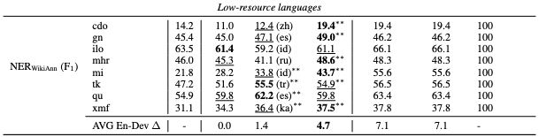

# WikiANN - NER - Table 3 (Low-resource languages)

This repo reproduces the results in Table 3 - Section 6.1 (Evaluation on low-resource languages)

## Baseline
``
python baseline.py
``

## Evaluation
``
python evaluation.py --exp_name tb3-lowresource
``

```
Loading ckpt and reproduce results for Table 3 - Low resource...
ckpt exists
Target language: cdo TEST ACC: 0.19417
Target language: gn TEST ACC: 0.49042
Target language: ilo TEST ACC: 0.61062
Target language: mhr TEST ACC: 0.48583
Target language: mi TEST ACC: 0.43719
Target language: tk TEST ACC: 0.54852
Target language: qu TEST ACC: 0.59836
Target language: xmf TEST ACC: 0.37500

```


## Checkpoint
``tb3-lowresource.ckpt``