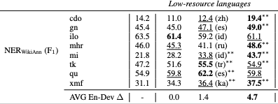

# WikiANN - NER - Table 3 (Low-resource languages)

This repo reproduces the results in Table 3 - Section 6.1 (Evaluation on low-resource languages)

## Baseline
``
python baseline.py
``

## Evaluation
``
python evaluation.py --exp_name tb3-lowresource
``

```
Target language: cdo TEST ACC: 19.42
Target language: gn TEST ACC: 49.04
Target language: ilo TEST ACC: 61.06
Target language: mhr TEST ACC: 48.58
Target language: mi TEST ACC: 43.72
Target language: tk TEST ACC: 54.85
Target language: qu TEST ACC: 59.84
Target language: xmf TEST ACC: 37.50

```


## Checkpoint
``tb3-lowresource.ckpt``