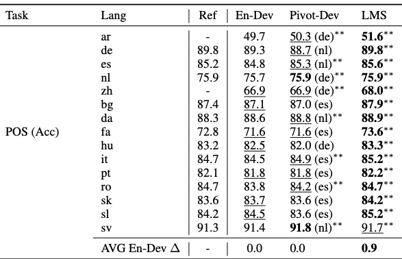

# POS - Table 3

This repo reproduces the results in Table 3 - POS

## Baseline
``
python baseline.py
python baseline_bg-sv.py
``

## Training
``
python run_train.py
``

## Evaluation
``
python run_evaluation.py
``

```
Loading ckpt and reproduce results for Table 3 POS...
Target lang: ar, TEST ACC: 51.6
Target lang: de, TEST ACC: 89.7
Target lang: es, TEST ACC: 85.5
Target lang: nl, TEST ACC: 75.8
Target lang: zh, TEST ACC: 68.3
Target lang: bg, TEST ACC: 87.9
Target lang: da, TEST ACC: 88.9
Target lang: fa, TEST ACC: 73.6
Target lang: hu, TEST ACC: 83.3
Target lang: it, TEST ACC: 84.8
Target lang: pt, TEST ACC: 82.2
Target lang: ro, TEST ACC: 84.7
Target lang: sk, TEST ACC: 84.2
Target lang: sl, TEST ACC: 85.2
Target lang: sv, TEST ACC: 91.9

```
