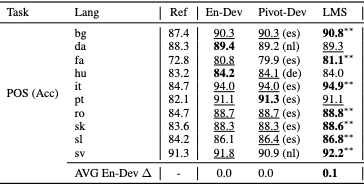

# POS - Table 4

This repo reproduces the results in Table 4 - Section 6.2 (Evaluation on multilingual fine-tuned models)

## Baseline
``
python baseline.py
``

## Training
``
python main_train_lms.py --exp_name tb4-ft
``

## Evaluation
``
python evaluation.py --exp_name tb4-ft
``

```
Target lang: bg, TEST ACC: 90.8
Target lang: da, TEST ACC: 89.3
Target lang: fa, TEST ACC: 81.1
Target lang: hu, TEST ACC: 84.0
Target lang: it, TEST ACC: 94.9
Target lang: pt, TEST ACC: 91.1
Target lang: ro, TEST ACC: 88.8
Target lang: sk, TEST ACC: 88.6
Target lang: sl, TEST ACC: 86.8
Target lang: sv, TEST ACC: 92.2
```


## Checkpoint
``tb4-ft.ckpt``