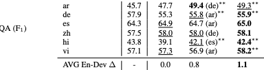

# MLQA - Table 3

This repo reproduces the results in Table 3 - QA

## Baseline
``
python baseline.py
``

```
====================
lang --- en-dev --- pivot-dev -- 100-target --- all-target
====================
ar--47.7--49.4--49.4--49.4
====================
de--55.3--55.8--57.1--55.8
====================
es--64.9--64.7--64.5--65.1
====================
zh--58.0--58.0--58.1--58.4
====================
hi--39.1--42.0--38.9--42.9
====================
vi--57.4--56.9--59.1--58.1
```

## Training
``
python run_train.py
``

## Evaluation
``
python evaluation.py
``

```
Loading ckpt and reproduce results for Table 3 QA...
ckpt exists
ckpt exists
ckpt exists
ckpt exists
ckpt exists
Target lang: ar, TEST ACC: 49.3
Target lang: de, TEST ACC: 55.9
Target lang: es, TEST ACC: 65.0
Target lang: zh, TEST ACC: 58.1
Target lang: hi, TEST ACC: 42.4
Target lang: vi, TEST ACC: 58.2

```
