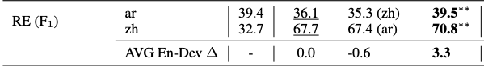

# RE - Table 3

This repo reproduces the results in Table 3 - RE

## Baseline
``
python baseline.py
``

## Training
``
python run_train.py
``

## Evaluation
``
python run_evaluation.py
``

```
Loading ckpt and reproduce results for Table 3 RE...
Target lang:ar, F1:36.90
Target lang:zh, F1:71.20
```
